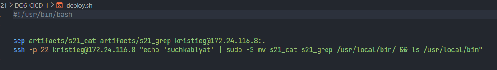

### Part 1. Настройка **gitlab-runner**

**== Задание ==**

##### Подними виртуальную машину *Ubuntu Server 22.04 LTS*
*Будь готов, что в конце проекта нужно будет сохранить дамп образа виртуальной машины*

##### Скачай и установи на виртуальную машину **gitlab-runner**

##### Запусти **gitlab-runner** и зарегистрируй его для использования в текущем проекте (*DO6_CICD*)
- Для регистрации понадобятся URL и токен, которые можно получить на страничке задания на платформе.

**== Выполнение ==** 

- Для начала клонируем репозиторий, заходим в него.
- Скачиваем gitlab-runner версии 15.0.1(с более новыми версиями у меня ошибки).
- После загрузки нужно пройти регистрацию, используем адрес и ключ который дается на старте проекта.
- Далее пропускаем все пункты Enter’ом кроме пункта где нужно выбрать исполнителя, там вводим shell.

### Part 2. Сборка

**== Задание ==**

#### Напиши этап для **CI** по сборке приложений из проекта *C2_SimpleBashUtils*:

##### В файле _gitlab-ci.yml_ добавь этап запуска сборки через мейк файл из проекта _C2_

##### Файлы, полученные после сборки (артефакты), сохрани в произвольную директорию со сроком хранения 30 дней.

**==Выполнение==**

- В папку src, копируем папки cat и grep для сборки.
- Создаем в репозитории yaml конфиг .gitlab-ci.yml, в нем прописываем пункт работы build, затем пишем скрипт к нему, где запускается сборка cat и grep из SimpleBashUtils. 
- Собранные файлы s21_cat и s21_grep переносим в папку artifacts, и ставим на папку artifacts время срока 30 дней.

- Проверяем наш пайплайн:

### Part 3. Тест кодстайла

**== Задание ==**

#### Напиши этап для **CI**, который запускает скрипт кодстайла (*clang-format*):

##### Если кодстайл не прошел, то «зафейли» пайплайн

##### В пайплайне отобрази вывод утилиты *clang-format*

**== Выполнение ==**

- Добавляем в yaml конфиг пункт работы style:

- Прописываем скрипт, где мы копируем файл кланг-формата и проверяем на стиль

- Зафейленный пайплайн с выводом:

- Пройденный пайплайн:

### Part 4. Интеграционные тесты

**== Задание ==**

#### Напиши этап для **CI**, который запускает твои интеграционные тесты из того же проекта:

##### Запусти этот этап автоматически только при условии, если сборка и тест кодстайла прошли успешно

##### Если тесты не прошли, то «зафейли» пайплайн

##### В пайплайне отобрази вывод, что интеграционные тесты успешно прошли / провалились

**== Выполнение ==**

- Добавляем в yaml конфиг пункт работы test для интеграционных тестов:

- Тесты не запускаются, т.к сборка и тест не прошли:

- Тесты запускаются, т.к сборка и тест прошли:

- Вывод самого пайплайна:

### Part 5. Этап деплоя

**== Задание ==**

##### Подними вторую виртуальную машину *Ubuntu Server 22.04 LTS*

#### Напиши этап для **CD**, который «разворачивает» проект на другой виртуальной машине:

##### Запусти этот этап вручную при условии, что все предыдущие этапы прошли успешно

##### Напиши bash-скрипт, который при помощи **ssh** и **scp** копирует файлы, полученные после сборки (артефакты), в директорию */usr/local/bin* второй виртуальной машины
*Тут тебе могут помочь знания, полученные в проекте DO2_LinuxNetwork*

##### В файле _gitlab-ci.yml_ добавь этап запуска написанного скрипта

##### В случае ошибки «зафейли» пайплайн

**== Выполнение ==**

- Запускаем вторую виртуалку, настраиваем второй адаптер у обоих машин, соединяем их между собой:

- На первой машине заходим в учетку gitlab-runner с помощью su, создаем ssh-ключ, передаем его второй виртуалке в .ssh/authorized_keys, для входа по ssh без пароля
- Создаем bash скрипт deploy.sh:

- В yaml создаем пункт работы deploy, в нем запускаем созданный скрипт

- Успешный пайплайн:

### Part 6. Дополнительно. Уведомления

**== Задание ==**

##### Настрой уведомления о успешном/неуспешном выполнении пайплайна через бота с именем «[ваш nickname] DO6 CI/CD» в *Telegram*

- Текст уведомления должен содержать информацию об успешности прохождения как этапа **CI**, так и этапа **CD**.
- В остальном текст уведомления может быть произвольным.

**== Выполнение ==**
- Под каждым пунктом работы в yaml добавляем строку after_script: - bash notification.sh, запуская скрипт уведомлений от телеграм бота
- Создаем телеграм бота в @BotFather, называет его nickname DO6 CI/CD, копируем его api и создаем notification.sh:

- После каждого пункта работы приходит уведомление от бота в зависимости от успешности прохождения:
